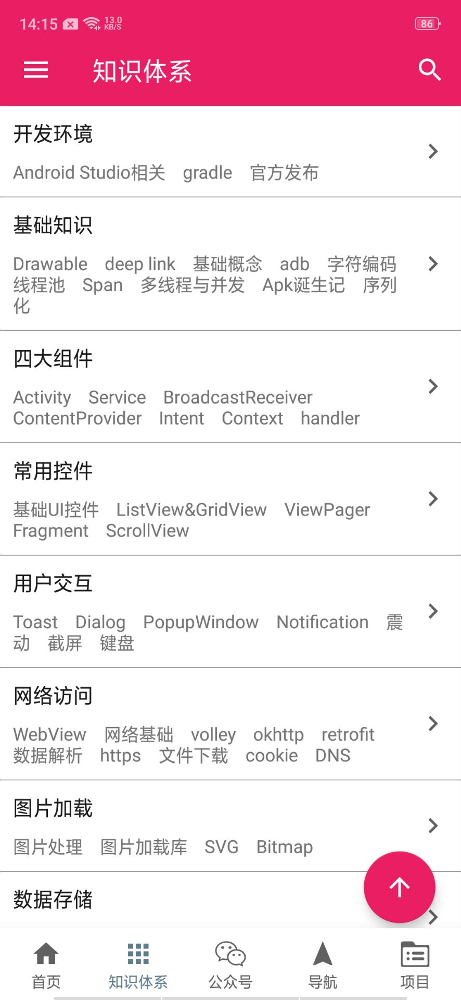
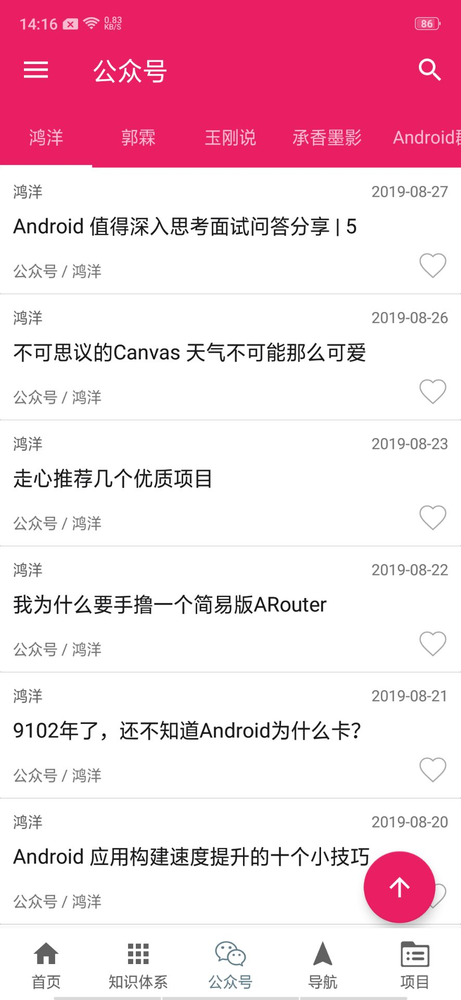
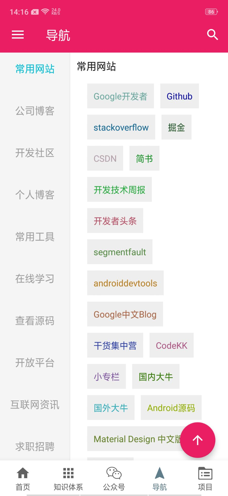
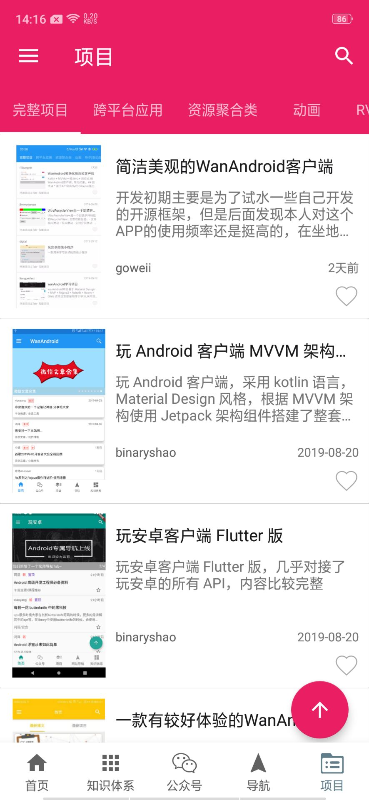
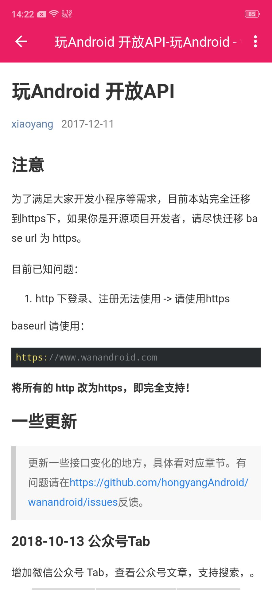
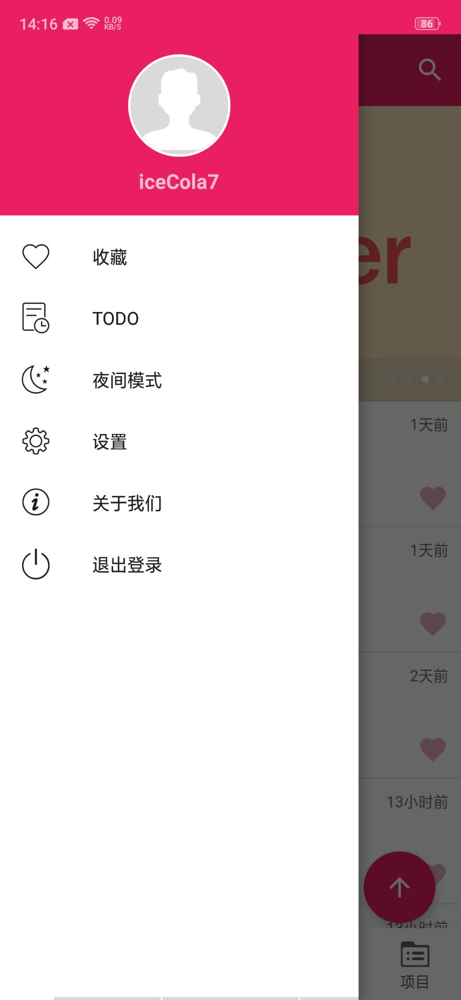
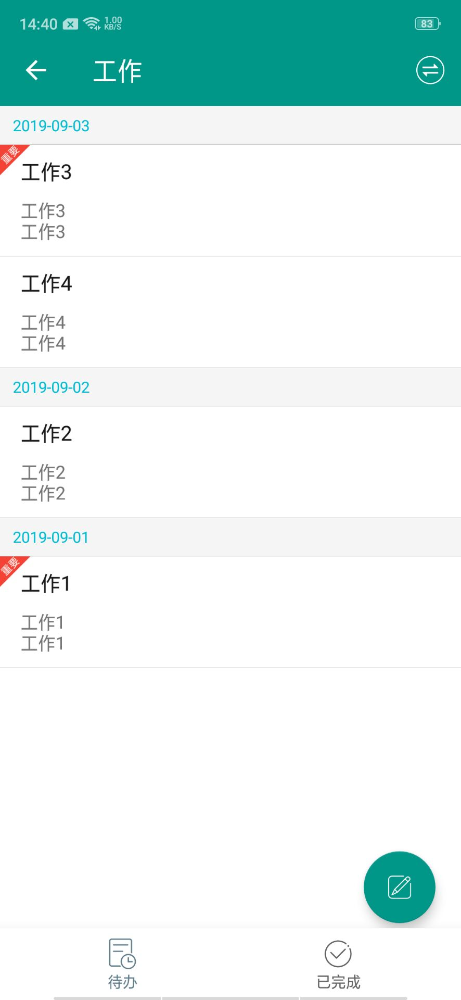
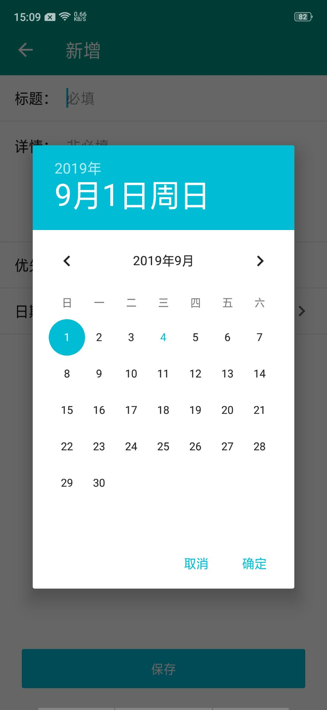
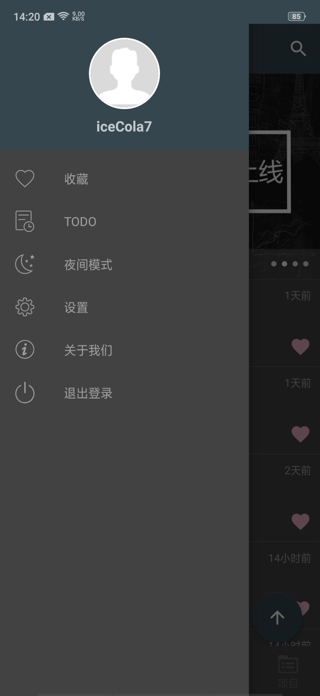
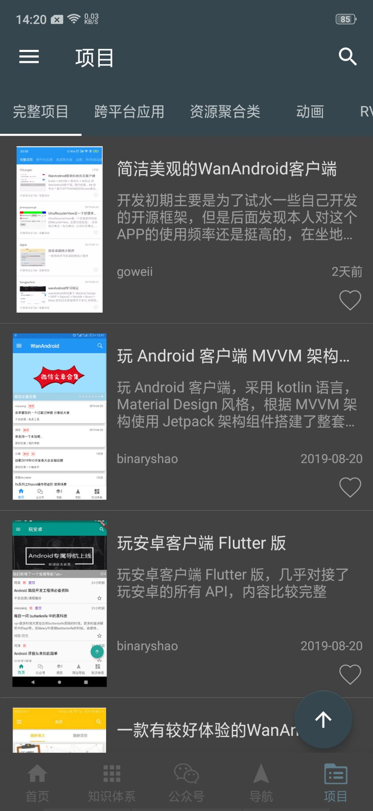

# Kotlin 版 WanAndroid 客户端

[![Platform][1]][2]  [![Build Status][3]][4]  [![Release][5]][6]  [![Release][7]][8]  [![GitHub license][9]][10]  [![][11]][12] 

[1]:https://img.shields.io/badge/platform-Android-blue.svg  
[2]:https://github.com/iceCola7/WanAndroid

[3]:https://travis-ci.com/iceCola7/WanAndroid.svg?branch=master
[4]:https://travis-ci.com/iceCola7/WanAndroid

[5]:https://img.shields.io/badge/API-16%2B-brightgreen.svg?style=flat
[6]:https://android-arsenal.com/api?level=16

[7]:https://img.shields.io/github/release/iceCola7/WanAndroid.svg
[8]:https://github.com/iceCola7/WanAndroid/releases/latest

[9]:https://img.shields.io/badge/license-Apache%202-blue.svg
[10]:https://github.com/iceCola7/WanAndroid/blob/master/LICENSE

[11]:https://img.shields.io/badge/QQ-563859095-orange.svg
[12]:http://wpa.qq.com/msgrd?v=3&uin=563859095&site=qq&menu=yes

- **Flutter 版 WANAndroid 客户端：[https://github.com/iceCola7/flutter_wanandroid](https://github.com/iceCola7/flutter_wanandroid)**
- **Kotlin 版 MVP 基础框架：[https://github.com/iceCola7/KotlinMVPSamples](https://github.com/iceCola7/KotlinMVPSamples)**
- **Java 版 MVP 基础框架：[https://github.com/iceCola7/MVPSamples](https://github.com/iceCola7/MVPSamples)**
- **Github 项目地址：[https://github.com/iceCola7/WanAndroid](https://github.com/iceCola7/WanAndroid)**

**开源不易，如果喜欢的话希望给个 `Star` 或 `Fork` ^_^ ，谢谢~~**

## 前言
前段时间学习了 `Kotlin` 的语法知识，然后就写了这个项目熟悉一下 `Kotlin` 语言，总体下来，感觉很爽，相比 `Java` 而言代码行数较少，方法数减少，再加上 `lambda` 语法让代码更加清晰。

## 简介
[WanAndroid](https://github.com/iceCola7/WanAndroid) 采用 `Kotlin` 语言编写，结合 `MVP` + `RxJava` + `Retrofit` + `Glide` + `EventBus` 等架构设计的项目，项目代码结构清晰并且有详细注释，如有任何疑问和建议请提 [Issues](https://github.com/iceCola7/WanAndroid/issues) 或联系 qq： **563859095** ，**项目会持续迭代维护，努力打造一款优秀的 [WanAndroid](http://www.wanandroid.com/) 客户端**。

## API
[**玩 Android 开放 API**](http://www.wanandroid.com/blog/show/2)

## 项目截图

|  |  |  |  |
| --- | --- | --- | --- |
|  |  |  |  |
|  |  |  |  |
|  |  |  |  |

## 下载体验

- 点击[](https://github.com/iceCola7/WanAndroid/raw/master/app/release/WanAndroid-release.apk) 下载

- 扫描下方二维码下载（**二维码，每日上限100次，如果达到上限，还是clone源码吧！**）

	

## 主要功能

- 首页、知识体系、公众号、导航、项目五大模块；
- 登录注册功能；
- 搜索功能：热门搜索、搜索历史；
- 收藏功能：添加收藏、取消收藏；
- 文章列表快速置顶功能；
- 侧滑返回功能；
- 浏览文章、分享文章、用浏览器打开文章；
- 我的积分、积分排行榜功能；
- TODO模块：新增待办、更新待办、查看待办、删除待办等功能；
- 夜间模式功能；
- 无图模式功能；
- 首页置顶文章开关；
- 自动切换夜间模式功能；
- 自定义切换主题颜色功能；
- 应用内提示更新 `APP` ；
- 清除缓存功能；
- 关于模块。

## 主要开源框架

 - [RxJava](https://github.com/ReactiveX/RxJava)
 - [RxAndroid](https://github.com/ReactiveX/RxAndroid)
 - [RxKotlin](https://github.com/ReactiveX/RxKotlin)
 - [Retrofit](https://github.com/square/retrofit)
 - [okhttp](https://github.com/square/okhttp)
 - [Glide](https://github.com/bumptech/glide)
 - [Anko](https://github.com/Kotlin/anko)
 - [moshi-kotlin](https://github.com/square/moshi)
 - [EventBus](https://github.com/greenrobot/EventBus)
 - [BRVH](https://github.com/CymChad/BaseRecyclerViewAdapterHelper)
 - [Logger](https://github.com/orhanobut/logger)
 - [AgentWeb](https://github.com/Justson/AgentWeb)
 - [FlowLayout](https://github.com/hongyangAndroid/FlowLayout)
 - [material-dialogs](https://github.com/afollestad/material-dialogs)
 - [BGABanner-Android](https://github.com/bingoogolapple/BGABanner-Android)
 - [VerticalTabLayout](https://github.com/qstumn/VerticalTabLayout)
 - [leakcanary](https://github.com/square/leakcanary)
 - [LitePal](https://github.com/LitePalFramework/LitePal)
 - [Android-Debug-Database](https://github.com/amitshekhariitbhu/Android-Debug-Database)
 - [FloatingActionButton](https://github.com/Clans/FloatingActionButton)
 - [MaterialDateTimePicker](https://github.com/wdullaer/MaterialDateTimePicker)
 - [AndroidAutoSize](https://github.com/JessYanCoding/AndroidAutoSize)

## 更新日志

**[最新更新日志请点击查看](https://github.com/iceCola7/WanAndroid/releases)**

**v1.1.8**

- 优化代码；
- 修复已知问题。

**v1.1.7**

- 修复已知问题。

**v1.1.6**

- 迁移至androidx。

**v1.1.5**

- 修复部分文章打开有广告的问题；
- 新增夜间模式下打开文章；
- 修复设置页链接跳转的问题。

**v1.1.4**

- 新增广场模块；
- 新增我的分享、分享文章、删除分享文章功能；
- 优化知识体系和导航到体系模块；
- 新增扫码下载；
- 关于我们移动到设置页面；
- 集成 `Tinker` 热更新；
- 优化代码和界面，修复已知问题。

**v1.1.3**

- 修复部分文章作者不显示问题；
- 增加官方网站。

**v1.1.2**

- 新增我的积分功能；
- 新增积分排行榜功能；
- 优化登录、注册和更新界面 `UI` ；
- 修复已知 `bug` 增强体验。

**v1.1.1**

- 玩 `Android` 接口升级为 `https` 。

**v1.1.0**

- 重构项目架构，优化代码；
- 重构 `TODO` 功能模块；
- 修改已知 `bug` 和部分 `UI` 。

**v1.0.8**

- 新增公众号模块，阅读公众号文章更方便；
- 优化部分 `UI` ；
- 修改已知 `bug` 。

**v1.0.7**

- 增加首页置顶文章；
- 增加退出登录接口；
- 增加手动检查更新；
- 优化代码，修改已知 `bug` 。

**v1.0.6**

- 增加 `Lifecycle` 组件使得 `Presenter` 和 `Activity` 生命周期绑定；
- 增加今日头条提供的屏幕适配方案，开源库 `AndroidAutoSize`；
- 升级 `AgentWeb` 到 `4.0.2` 版本，并修改部分 `API` 改动的问题；
- 增加网络请求失败后的请求重连操作，具体请查看类 [RetryWithDelay](https://github.com/iceCola7/WanAndroid/blob/master/app/src/main/java/com/cxz/wanandroid/http/function/RetryWithDelay.kt)；
- 解决转屏时，项目页视图空白的问题；
- 去掉 `Tablayout` 切换时的动画，优化体验；
- 修改其他已知 `bug` 。

**v1.0.5**

- 增加TODO功能；
- 增加有无网络的状态提示信息；
- 增加无网切换到有网的重连操作；
- 修改已知 `bug`，如：[#6](https://github.com/iceCola7/WanAndroid/issues/6) 。

**v1.0.3**

- 集成 `bugly` 应用内更新；
- 优化沉浸式状态栏显示效果；
- 优化登录注册界面；
- 修改 `VerticalTabLayout` 的点击 `item` 滑动的问题；
- 优化夜间模式和自动切换夜间模式。

**v1.0.2**

- 优化细节问题；
- 修改已知 `bug` 。

**v1.0.1**

- 增加搜索功能，包含热门搜索和历史搜索；
- 增加 `litepal` 数据库；
- 增加 `bugly` 收集应用异常信息；
- 增加 `Android-Debug-Database` 来查看数据库；
- 修复已知 `bug` 。

**v1.0.0**

- 初始化版本，主要功能都已经完成。

## Thanks

**感谢所有优秀的开源项目 ^_^** 。

## Statement
**项目中的 API 均来自于 [www.wanandroid.com](http://www.wanandroid.com/) 网站，纯属学习交流使用，不得用于商业用途。**

## LICENSE

```
Copyright 2018 iceCola7 

Licensed under the Apache License, Version 2.0 (the "License");
you may not use this file except in compliance with the License.
You may obtain a copy of the License at

   http://www.apache.org/licenses/LICENSE-2.0

Unless required by applicable law or agreed to in writing, software
distributed under the License is distributed on an "AS IS" BASIS,
WITHOUT WARRANTIES OR CONDITIONS OF ANY KIND, either express or implied.
See the License for the specific language governing permissions and
limitations under the License.
```