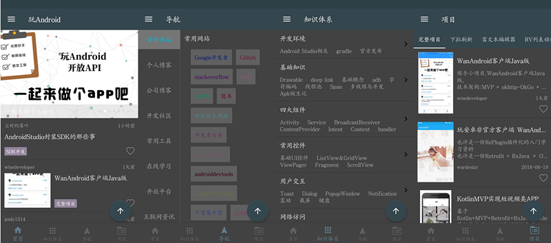

# WanAndroid

[![Platform][1]][2]  [![Build Status][3]][4]  [![Release][5]][6]  [![GitHub license][7]][8]  [![][9]][10]  

[1]:https://img.shields.io/badge/platform-Android-blue.svg  
[2]:https://github.com/bjchenxz/WanAndroid

[3]:https://travis-ci.org/bjchenxz/WanAndroid.svg?branch=master
[4]:https://travis-ci.org/bjchenxz/WanAndroid

[5]:https://img.shields.io/github/release/bjchenxz/WanAndroid.svg
[6]:https://github.com/bjchenxz/WanAndroid/releases/latest

[7]:https://img.shields.io/badge/license-Apache%202-blue.svg
[8]:https://github.com/bjchenxz/WanAndroid/blob/master/LICENSE

[9]:https://img.shields.io/badge/QQ-563859095-orange.svg
[10]:https://github.com/bjchenxz/WanAndroid

##### `Github` 地址：[https://github.com/bjchenxz/WanAndroid](https://github.com/bjchenxz/WanAndroid)
(开源不易，如果喜欢的话希望给个 `Star` 或 `Fork` ，谢谢)

## 前言
前段时间学习了 `Kotlin` 的语法知识，然后就写了这个项目熟悉一下 `Kotlin` 语言，总体下来，感觉很爽，相比 `Java` 而言代码行数较少，方法数减少，再加上 `lambda` 语法让代码更加清晰。

`Kotlin` 团队为 `Android` 开发提供了一套超标准语言功能的工具：

- [Kotlin Android 扩展](https://www.kotlincn.net/docs/tutorials/android-plugin.html) 是一个编译器的扩展，可以让你摆脱代码中的 `findViewById` 的调用；
- [Anko](http://github.com/kotlin/anko) 是 `JetBrains` 开发的一个强大的库，它主要的目的是用来替代以前 `XML` 的方式来使用代码生成 `UI` 布局的，它包含了很多的非常有帮助的函数和属性来避免让你写很多的模版代码。

## 简介
[WanAndroid](https://github.com/bjchenxz/WanAndroid) 采用 `Kotlin` 语言编写，结合 `MVP` + `RxJava` + `Retrofit` + `Glide` + `EventBus` 等架构设计的项目，项目代码结构清晰并且有详细注释，如有任何疑问和建议请提 `Issue` 或联系 
[]()，**项目会持续迭代维护，努力打造一款优秀的 [WanAndroid](http://www.wanandroid.com/) 客户端**。

## API
[https://github.com/hongyangAndroid/wanandroid](https://github.com/hongyangAndroid/wanandroid)

## 主要功能
- **首页**：轮播图
- **知识体系**：开发环境、基础知识、用户交互等
- **知识体系专题**
- **导航**：常用网站、个人博客、公司博客、开发社区、常用工具等
- **完整项目**
- **登录、注册、注销**
- **收藏**：我的收藏、添加收藏、取消收藏
- **文章内容**
- **分享文章**
- **夜间模式**
- **无图模式**
- **自动切换夜间模式**
- **切换主题颜色**
- **清除缓存**
- **关于我们**

## 项目截图




## 主要开源框架
 - [RxJava](https://github.com/ReactiveX/RxJava)
 - [RxAndroid](https://github.com/ReactiveX/RxAndroid)
 - [RxKotlin](https://github.com/ReactiveX/RxKotlin)
 - [Retrofit](https://github.com/square/retrofit)
 - [okhttp](https://github.com/square/okhttp)
 - [Glide](https://github.com/bumptech/glide)
 - [Anko](https://github.com/Kotlin/anko)
 - [moshi-kotlin](https://github.com/square/moshi)
 - [EventBus](https://github.com/greenrobot/EventBus)
 - [BRVH](https://github.com/CymChad/BaseRecyclerViewAdapterHelper)
 - [Logger](https://github.com/orhanobut/logger)
 - [AgentWeb](https://github.com/Justson/AgentWeb)
 - [FlowLayout](https://github.com/hongyangAndroid/FlowLayout)
 - [material-dialogs](https://github.com/afollestad/material-dialogs)
 - [BGABanner-Android](https://github.com/bingoogolapple/BGABanner-Android)
 - [VerticalTabLayout](https://github.com/qstumn/VerticalTabLayout)
 - [leakcanary](https://github.com/square/leakcanary)

## 更新日志

**v1.0.0**

- 初始化版本，主要功能都已经完成。

## Thanks
感谢所有优秀的开源项目

## LICENSE

```
Copyright 2018 bjchenxz 

Licensed under the Apache License, Version 2.0 (the "License");
you may not use this file except in compliance with the License.
You may obtain a copy of the License at

   http://www.apache.org/licenses/LICENSE-2.0

Unless required by applicable law or agreed to in writing, software
distributed under the License is distributed on an "AS IS" BASIS,
WITHOUT WARRANTIES OR CONDITIONS OF ANY KIND, either express or implied.
See the License for the specific language governing permissions and
limitations under the License.
```